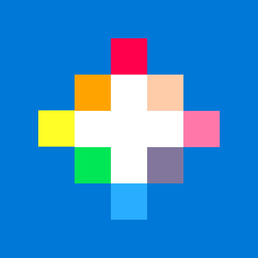
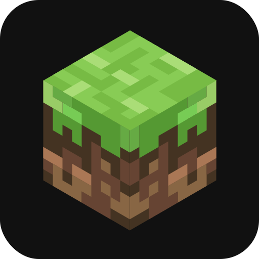

## Hi there, I'm ArkanYota 👋

### I'm a French Student Developer. 
- 🇫Lang: French
- 📫Contact on Discord: arkanyota#3321

### How to contact me: 

### Language used: 
     
Et Löve

### Games played:

### Projects:
- dotfiles : Fichier config linux
  - https://github.com/ARKANYOTA/dotfiles
- Cours2022Git : Mes cours au lycée
  - https://github.com/ARKANYOTA/Cours2022Git
- ay-vim-note : Application qui permet de gérer les cours avec le terminal. et lancer vim.
  - https://github.com/ARKANYOTA/ay-vim-note
- ArkanYotaGame : Jeu sur invite de commande en Python
  - https://pypi.org/project/ArkanYotaGame/
- Omega : Un fork de Omega(menu pour changer la couleur de la led)
  - https://github.com/ARKANYOTA/Omega
  - https://github.com/Omega-Numworks/Omega
- Messy-Pypi : Plein de petit programes en python(ou autres) pour atteindre les 67k lignes
  - https://github.com/Maxim-Costa/messy-pypi
- Chaser of Dawn : Jeu pour la game Jam Ludum Dare 47 en Pico 8
  - https://ldjam.com/events/ludum-dare/47/chaser-of-dawn
- Anchors & Miners : Jeu pour la game Jam Ludum Dare 48 en Pico 8
  - https://ldjam.com/events/ludum-dare/48/anchors-miners
- OctoBoom : Jeu pour la game Jam Ludum Dare 49 en Löve
  - https://ldjam.com/events/ludum-dare/49/octoboom
  - https://github.com/ARKANYOTA/ludumdare49

Make Achievements:
- Test 1: PairExtraordinaire x2 Bronze
- Test 2: PairExtraordinaire x2 Bronze
