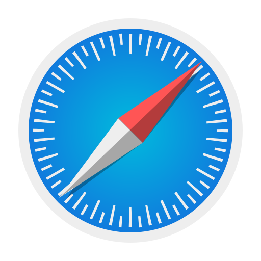

## Salut, je suis ArkanYota 👋  
  
### Je suis un développeur et étudiant français.  
- Langue : Français
- Contact sur Discord : [arkanyota](https://discord.com/users/315241140464910349)
- Contact sur Mail: [arkanyota@icloud.com](mailto:arkanyota@icloud.com)
- Ecole : [ENSEEIHT](https://enseeiht.fr)

### Mon site : **https://arkanyota.github.io**
  
### Comment me contacter :  
  

  
### Langages utilisés (et éditeurs):  

### Projets :  
- **Globs**   : Jeu pour la game Jam GMTK 2024  
- **Chaser of Dawn** : Jeu pour la game Jam Ludum Dare 47 en Pico 8  
  - https://ldjam.com/events/ludum-dare/47/chaser-of-dawn  
- **Anchors & Miners** : Jeu pour la game Jam Ludum Dare 48 en Pico 8  
  - https://ldjam.com/events/ludum-dare/48/anchors-miners  
- **OctoBoom** : Jeu pour la game Jam Ludum Dare 49 en Löve  
  - https://ldjam.com/events/ludum-dare/49/octoboom  
- **ASM Minesweeper** : Un jeu de démineur réalisé en Assembleur x86-64  
- **GitHub Achievement Validator**:
  - **Galaxy Brain** : Valide l'achievement Galaxy Brain en utilisant 2 comptes Github
  - **DrawOnGithubActivity** : Permet de dessiner sur le graphe des activités de Github a partir d'une image
  - **Coauthored** : Valide l'achievement Coauthored
- **RayMarchingC** : Un Ray Marching écrit en C
- **Fr Grid Clock** : (Fork) L'heure affichée avec du texte sous la forme d'une grille  
- **Venal** : Vlc player on terminal  
- **ArkanYotaGame** : Jeu en ligne de commande en Python (projet abandonné)  
  - https://pypi.org/project/ArkanYotaGame/  
- **Omega** : Un fork de Omega (menu pour changer la couleur de la led)  
- **Clavier Morse Arduino** : Un clavier à un seul bouton pour écrire du morse sur Arduino
- **Proof Tree Ocaml** : Faire des arbres de dérivations, et les rendre en LaTeX.
- **Doomineur** 
: Faire un démineur à la Doom (projet abandonné, c'est un raycasting)

### Write-Ups:
- Le [404ctf](https://www.404ctf.fr), arrivé 130e sur 2 460 au classement avec 18 859 points, sur la 1re édition, et arrivé 185e sur 2 335 au classement avec 8 732 points, sur la 2e édition.
- Le CTF de la conférence de l'Open Cycom Montpellier 2023, où on est arrivé 2eme avec mon équipe sur 25 team, avec 2 920 points.

[Write-Ups: ICI](https://github.com/ARKANYOTA/write-ups)

### Autres

  
  
    

